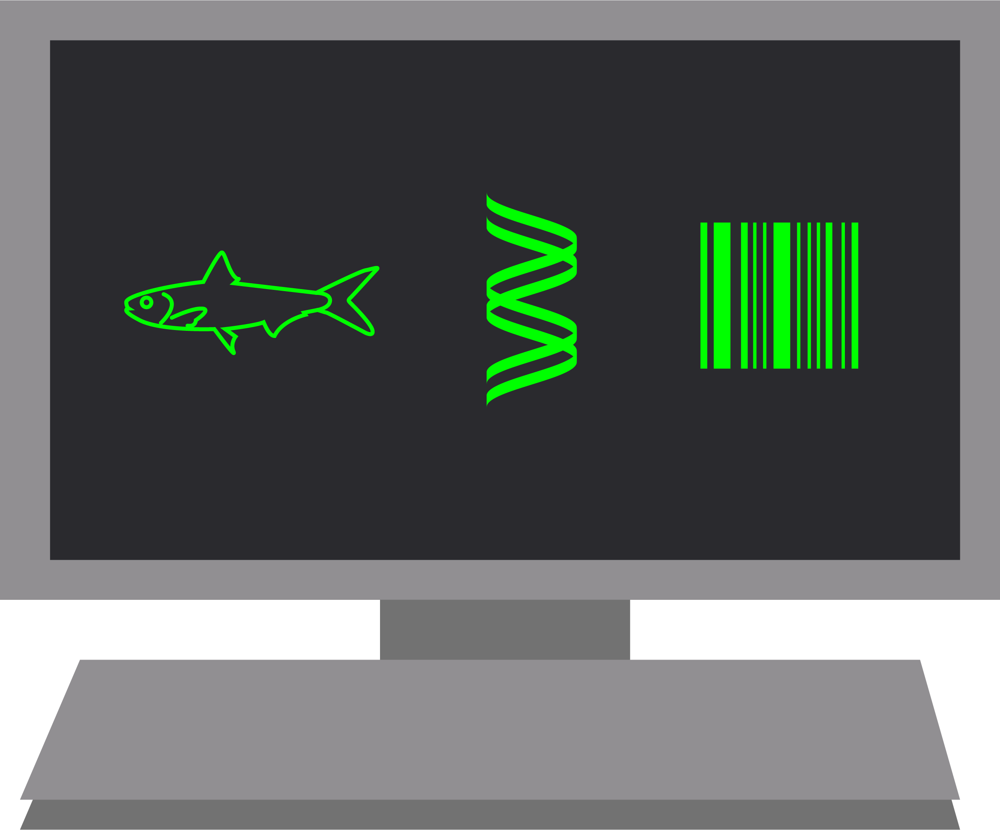

### West Coast OBON always welcomes new members or contributors to our growing community of eDNA practitioners!

#### We currently have an open call for a postdoctoral researcher at Scripps Institution of Oceanography. Please see a brief description below and contact Dr. Nastassia Patin at nvpatin\@ucsd.edu with questions.

[Scripps Institution of Oceanography](https://scripps.ucsd.edu/) and the California Cooperative Oceanic Fisheries Investigations ([CalCOFI](calcofi.org)) are seeking a postdoctoral scholar to investigate the biological oceanography of blue water (open ocean) marine environments by developing and applying cutting edge molecular assays to environmental DNA (eDNA) samples. In particular, our goal is to generate quantitative estimates of metazoan organisms from low-biomass open ocean samples. Nucleic acids from these taxa compose a small fraction of the eDNA pool and may be highly degraded. The candidate will combine innovative sampling techniques developed for oceanographic vessels with cutting-edge molecular biology methods developed by the Knight Lab in the UCSD Department of Bioengineering. Approaches that target and quantify these molecules may include, but are not limited to, assessment of DNA:RNA marker ratios; synthetic DNA sequencing spike-ins; molecular bait hybridization; nanotrap beads; unique molecular identifiers (UMIs); and species-specific digital PCR assays. The candidate will develop new, high-throughput workflows to computationally analyze the resulting data and infer biological patterns in novel ways. Importantly, they will get to apply these methods to targeted research questions based on their own interests in close coordination with their supervisor and collaborators; examples may include:

A. What drives ecological connectivity across blue-water habitats—currents, biotic interactions, or persistent oceanographic features?

B. How resilient are open-ocean and deep-water ecosystems (and their ecological connections) to climate change?

C. How do water-mass characteristics structure ecosystems in the abyssal ocean?

D. Are charismatic megafauna more common than expected in remote high-seas habitats, and can eDNA and other biomolecular methods improve surveys of rare animals?

E. What cryptic biodiversity and unexpected ecological patterns exist in blue-water habitats?

### 

